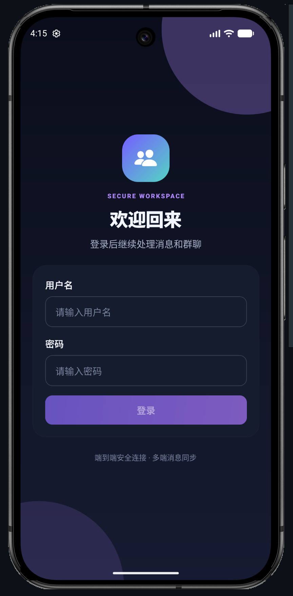
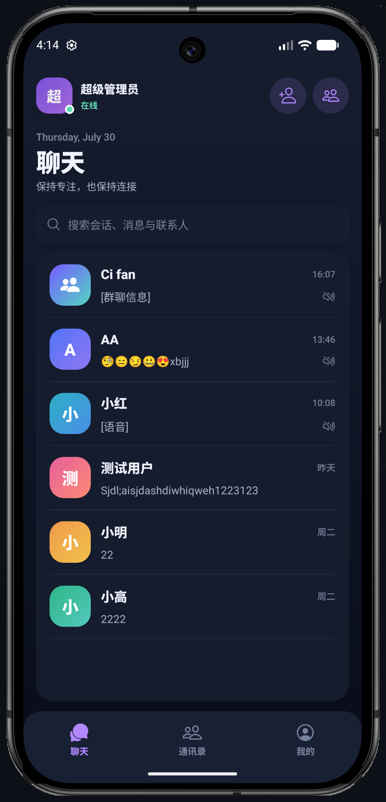
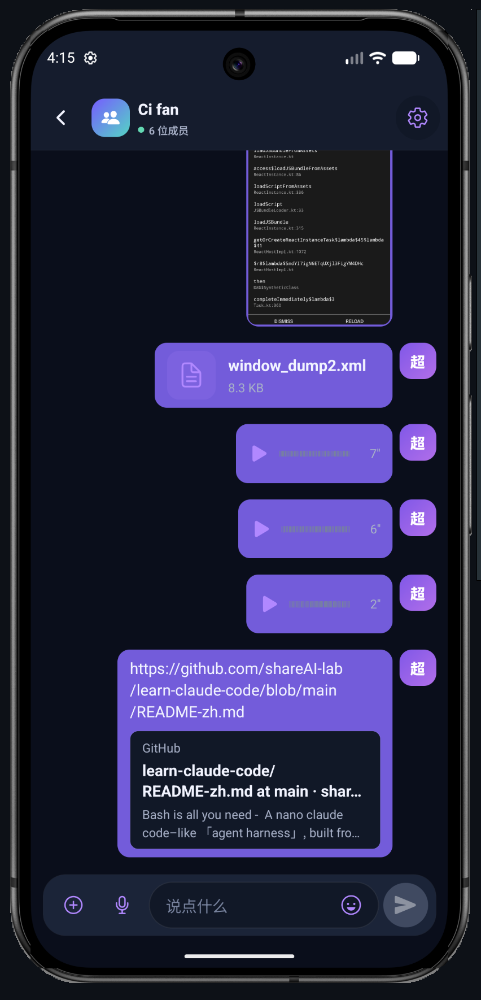
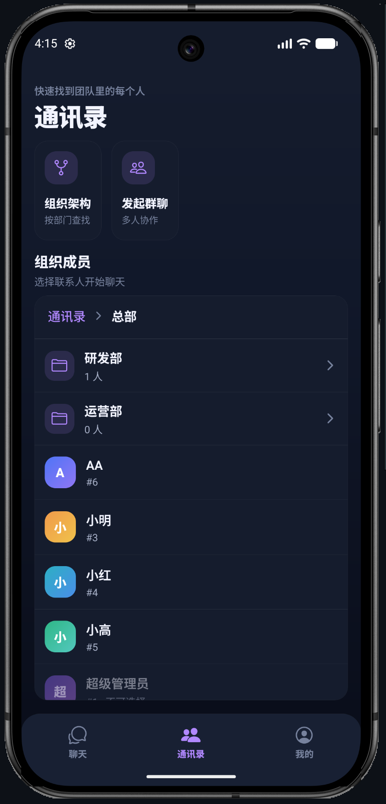
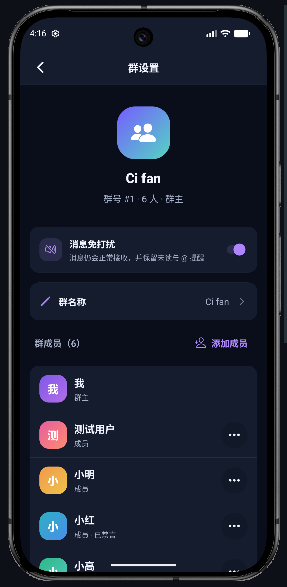

# RBAC-Server

以 RBAC 权限体系为底座的企业协作平台，包含 Vue 管理后台、Spring Boot 业务服务、Netty IM 网关和 React Native 移动客户端。项目在统一用户、部门、角色和数据权限之上，提供单聊、群聊、富媒体消息、离线同步、已读回执与群组管理等完整 IM 能力。

## 📱 IM 移动端

| 登录 | 会话列表 | 聊天 |
| --- | --- | --- |
| [](im-client/packages/app-mobile/docs/images/im-login.png) | [](im-client/packages/app-mobile/docs/images/im-conversations.png) | [](im-client/packages/app-mobile/docs/images/im-chat.png) |

| 组织通讯录 | 群设置 |
| --- | --- |
| [](im-client/packages/app-mobile/docs/images/im-contacts.png) | [](im-client/packages/app-mobile/docs/images/im-group-settings.png) |

移动端功能、架构和运行方式详见 [`im-client/packages/app-mobile/README.md`](im-client/packages/app-mobile/README.md)。

## ✨ 核心能力

### 企业 IM

- **完整消息链路**：React Native 客户端通过 Netty WebSocket 网关保持长连接，网关与 Spring Boot IM 逻辑通过 Kafka 解耦。
- **丰富消息形态**：支持文本、图片、文件、语音、表情和链接卡片，以及引用、`@`、撤回、失败重试和媒体传输进度。
- **多端同步**：本地 SQLite 缓存会话与消息，支持离线消息同步、已读回执、未读数和连接自动恢复。
- **企业通讯录**：复用 RBAC 用户与部门数据，按组织架构选人并直接发起单聊或群聊。
- **群组管理**：支持成员增删、群主转让、管理员设置、成员禁言、消息免打扰、退出与解散群聊。
- **分层存储**：MySQL 保存会话与群组元数据，MongoDB 保存消息，Redis 保存在线路由，MinIO 保存富媒体文件。

### RBAC 权限管理

- **三层权限模型**：Spring Security 登录判定 → `@PreAuthorize` 权限标识 → Service 层业务二次校验（禁止删超管、禁止改自身最高角色等）。
- **动态路由 + 按钮权限**：后端菜单生成前端路由，`v-permission` / `PermissionButton` 控制按钮级权限。
- **数据权限**：`DataScope`（全部 / 自定义部门 / 本部门及子部门 / 本部门 / 仅本人）在 Service 层显式接入，列表接口不可绕过。
- **JWT 双 Token**：Access + Refresh，401 刷新单飞重放，登出 / 改密 / 强退后旧 Token 立即失效。
- **国际化（中 / 英）**：前端 vue-i18n，后端 `MessageSource` 按 `Accept-Language` 返回本地化异常与校验消息。
- **主题切换**：Web 管理端和 IM 移动端均支持浅色、深色与跟随系统。

## 🧱 技术栈

| 层 | 技术 |
| --- | --- |
| 业务后端 | Java 21 · Spring Boot 3.4.1 · Spring Security · MyBatis-Plus 3.5.9 · Maven |
| IM 网关 | Netty · WebSocket · JWT · Kafka · Redis |
| Web 管理端 | Vue 3.5 · TypeScript · Vite · Pinia · Vue Router · Element Plus · Tailwind 4 |
| IM 移动端 | React Native 0.86 · React 19 · TypeScript · Zustand · React Navigation |
| IM SDK | `@im/sdk-core` · `@im/sdk-rn` · SQLite · Keychain/Keystore |
| 数据与中间件 | MySQL 8.4 · Redis 7.4 · Kafka 3.9 · MongoDB 7 · MinIO |

## 🔄 IM 消息链路

```text
React Native 客户端
├── HTTP API ───────────────> Spring Boot IM 逻辑 ──> MySQL / MongoDB / MinIO
└── WebSocket ──> Netty 网关 <── Kafka ────────────> Spring Boot IM 逻辑
                         └───── Redis 在线路由 <─────┘
```

HTTP API 负责认证、会话同步、群组、通讯录和媒体凭证；WebSocket 负责实时消息、回执与连接状态。网关只处理连接、鉴权和路由，成员权限、禁言、消息落库等业务规则由后端统一校验。

## 🔔 Android 消息推送

Android 客户端使用 Firebase Cloud Messaging（FCM）补充后台消息提醒；在线消息仍走既有 WebSocket。消息落库和提及状态更新后，后端通过独立的 `im-push` Kafka 消费链异步发送 FCM，推送故障不会回滚消息主链。前台只触发权威同步，不显示系统通知；后台通知显示发送人和经过裁剪的安全摘要。

### 服务端启用

推送默认关闭。Firebase Admin 必须通过 Application Default Credentials（ADC）或云平台工作负载身份取得凭证，生产环境也可以挂载受管 Secret 并让 ADC 读取。禁止把服务账号 JSON、私钥或凭证内容写入仓库、APK、`application.yml`、环境变量示例和日志。

```bash
export IM_PUSH_ENABLED=true
mvn -f backend/pom.xml spring-boot:run
```

配置位于 `rbac.im.push`：`enabled` 是总开关，`fresh-days` 控制有效登记的最近活跃天数，`ttl-seconds` 控制 FCM 数据消息 TTL（默认 86400 秒）。消费者最多尝试 4 次，采用 1 秒起步、最大 30 秒的随机指数退避；耗尽后进入 `im-push.DLT`。永久无效目标会被禁用。

运维应监控 `im.push.candidates`、`im.push.targets`、`im.push.delivery`、`im.push.latency` 和 `im.push.dlt`。指标标签和日志只能使用 `msgId` 与枚举化粗粒度错误码；不得记录 FCM 目标、消息摘要、发送人、原始 Payload、访问令牌或 Firebase 凭证。Firebase 接受发送任务不等于设备已经展示通知。

Android Firebase 客户端配置、自动验证命令和待执行真机矩阵见[移动端 FCM 配置与验收](im-client/packages/app-mobile/README.md#5-android-fcm-推送配置与验收)。部署环境示例保持 `IM_PUSH_ENABLED=false`，完成非生产环境验收后再分批开启。

## 📁 目录结构

```text
RBAC-Server/
├── backend/      Spring Boot 业务后端（RBAC + IM 逻辑与 HTTP API）
├── frontend/     Vue 3 RBAC 管理后台
├── im-gateway/   Netty WebSocket 接入网关
├── im-client/    IM SDK 与 React Native 移动客户端
├── deploy/       Docker Compose 与中间件配置
├── docs/         RBAC、IM、部署与学习文档
└── pom.xml       Maven 聚合工程（backend + im-gateway）
```

## 🚀 快速开始

### 1. 启动中间件

仅开发 RBAC 管理端时启动 MySQL 和 Redis：

```bash
cd deploy
docker compose up -d mysql redis
```

联调完整 IM 链路时，同时启动 Kafka、MongoDB 和 MinIO：

```bash
cd deploy
docker compose --profile full --profile im up -d mysql redis kafka mongodb minio
```

### 2. 启动业务后端

```bash
mvn -f backend/pom.xml spring-boot:run
```

HTTP API：`http://localhost:8080/api`。首次启动会自动执行幂等的 `schema.sql` 和 `data.sql`。

### 3. 启动 IM 网关

```bash
mvn -f im-gateway/pom.xml spring-boot:run
```

WebSocket 地址：`ws://localhost:9001/im`。

### 4. 启动 Web 管理端

```bash
cd frontend
npm install
npm run dev
```

### 5. 启动 IM 移动端

```bash
cd im-client
npm install
npm run start --workspace app-mobile
```

保持 Metro 运行，在另一个终端启动 Android：

```bash
cd im-client
npm run android --workspace app-mobile
```

iOS、真机和服务地址配置详见 [移动端开发说明](im-client/packages/app-mobile/README.md#本地运行)。

默认账号：`admin` / `admin123`。

## 🛠 常用命令

| 用途 | 命令 |
| --- | --- |
| 启动 RBAC 中间件 | `cd deploy && docker compose up -d mysql redis` |
| 启动 IM 中间件 | `cd deploy && docker compose --profile full --profile im up -d mysql redis kafka mongodb minio` |
| 后端运行 | `mvn -f backend/pom.xml spring-boot:run` |
| IM 网关运行 | `mvn -f im-gateway/pom.xml spring-boot:run` |
| Java 模块测试 | `mvn test` |
| Web 前端开发 | `cd frontend && npm run dev` |
| Web 前端检查 | `cd frontend && npm run type-check && npm run lint` |
| Web 前端构建 | `cd frontend && npm run build` |
| IM SDK 测试 | `cd im-client && npm test` |
| IM 移动端测试 | `cd im-client/packages/app-mobile && npm test` |
| IM 移动端检查 | `cd im-client/packages/app-mobile && npm run lint && npx tsc --noEmit` |

## 📐 约定要点

- **API 契约**：DB 使用 snake_case，API 统一 camelCase；枚举使用固定字符串；HTTP API 统一前缀 `/api`。
- **统一响应**：`Result<T> {code,message,data}`；分页使用 `PageRequest` / `PageResult`；异常使用 `BusinessException` + `GlobalExceptionHandler`。
- **实体基类**：`BaseEntity` 提供审计字段和逻辑删除能力。
- **IM 协议**：会话使用 `cid` 标识，服务端使用单调递增 `seq` 确定消息顺序，客户端使用 `clientMsgId` 保证发送幂等。
- **国际化**：后端文案位于 `backend/src/main/resources/i18n/messages*.properties`，Web 前端文案位于 `frontend/src/locales/{zh-CN,en-US}.ts`。

## 🔒 安全红线

- 前端隐藏仅用于改善体验，敏感操作必须由后端再次鉴权。
- 数据权限（`dept_id` / `created_by` 过滤）不可绕过，也不可漏接列表接口。
- WebSocket 握手必须校验 JWT；发送消息前必须校验会话成员身份、群角色和禁言状态。
- 媒体上传、下载必须使用受限凭证或签名地址，不向客户端暴露存储服务凭证。
- 日志和参数返回不得出现密码、Token、完整身份证等敏感信息；操作日志参数需要限长。
- 推送日志、异常、链路追踪和指标不得出现 FCM 目标、原始 Payload 或消息摘要；Firebase Admin 凭证只能由 ADC、工作负载身份或受管 Secret 提供。
- `application.yml`、`deploy/.env` 中的本地密码不得直接用于生产，JWT 密钥必须通过环境变量覆盖。

## 📚 文档

- [IM 移动端开发说明](im-client/packages/app-mobile/README.md)
- [IM HTTP 接口文档](docs/10-IM接口文档.md)
- [IM 架构学习路线](docs/learning-im/00-IM后端学习路线.md)
- [环境搭建](docs/01-环境搭建.md)
- [RBAC 后端设计](docs/04-RBAC后端设计.md)
- [前端 RBAC 设计](docs/05-前端RBAC设计方案.md)
- [部署上线指南](docs/09-部署上线指南.md)
