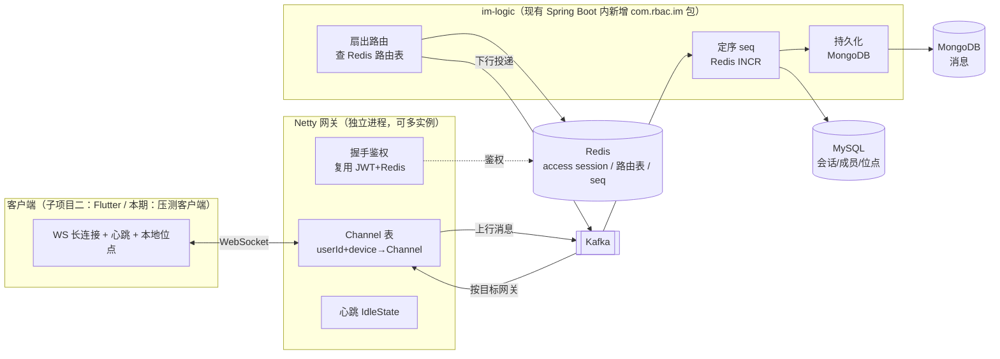

# IM 聊天系统（仿企业微信）设计方案 — 子项目一：后端 MVP

> 状态：已通过头脑风暴评审（2026-07-22）。定位：学习 / 简历作品。
> 前端 Flutter、无 Web 端。本方案只覆盖**子项目一：后端 MVP**。

## 背景（为什么做、做什么）

在现有 RBAC-Server（Spring Boot 3.4 + MyBatis-Plus + MySQL + Redis）里新增一个**仿企业微信的即时通讯系统**。

定位：**学习 / 简历作品**。"50 万并发"不是真要买几十台机器扛住，而是作为**架构约束 + 压测演示目标**——方案在设计上必须能水平扩展到 50 万在线长连接，并能在单机/少量节点上跑通、压测演示到可讲清楚的量级。

已确认方向：
- **功能边界**：单聊 + 群聊 + 离线消息（含已读未读、多端同步）；**消息类型**：文本、图片、音频（语音）、文件、链接（卡片）；**消息撤回**；**@提及**（@成员 / @所有人，含"有人@我"标记）。**不做**：音视频实时通话、消息编辑、朋友圈等。
- **接入层**：**Netty 独立网关**（专管长连接），业务逻辑在 Spring Boot 里。先跑单节点，集群路由作为设计方案 + 下一阶段。
- **消息存储**：**引入 MongoDB** 存消息（含富媒体元数据与引用），会话/成员/位点等元数据用现有 MySQL。
- **对象存储**：**引入 MinIO**（自托管、S3 协议）存图片/音频/文件二进制，消息体只存引用；生产可无缝切阿里云 OSS（同为 S3 兼容）。

### 大工程拆分（每个子项目独立 设计→计划→实现）
- **子项目一（本方案）**：IM 后端 MVP。Netty 网关 + im-logic + MongoDB + Kafka + Redis 路由，跑通单聊/群聊/离线/已读/多端同步。用**轻量测试客户端**（Java 压测脚本 / CLI）验证，不依赖 Flutter。
- **子项目二**：Flutter 客户端（本地 SQLite 增量同步、断线重连、聊天 UI）。
- **子项目三**：集群化 + 压测到 50 万的演示与调优（多网关、内核参数、堆外内存、监控面板）。

---

## 总体架构

**核心解耦**：网关只管"连接 + 收发字节"，无业务状态（连接状态在本机内存，路由在 Redis）→ 网关**无状态、可水平扩展**；im-logic 通过 Kafka 与网关通信，不直接依赖。这是"50 万并发怎么扩"的骨架。

---

## 组件与部署形态

| 组件 | 形态 | 说明 |
|------|------|------|
| Netty 网关 | **新增 Maven module `im-gateway`**，独立 `@SpringBootApplication` + Netty | 独立进程/容器，可起多实例。轻量：只依赖 Netty + Redis + Kafka 客户端 |
| im-logic | 现有应用内新增包 `com.rbac.im`（entity/mapper/service/consumer/mongo） | 复用现有 MyBatis-Plus / Redis / 事务基建 |
| MongoDB | compose 新增 `mongodb` 服务（新 profile `im`） | 存消息正文（含富媒体元数据） |
| MinIO | compose 新增 `minio` 服务（profile `im`） | 图片/音频/文件二进制，S3 协议，生产可切阿里云 OSS |
| Kafka | compose 已有（profile `full`）| inbound / outbound topic |
| Redis | 已有 | 复用 access session；新增路由表、会话 seq |
| MySQL | 已有 | 会话、成员、已读位点、群信息 |

---

## 认证与握手（复用现有基建，满足安全红线）

- 客户端连接 `wss://.../im?token=<accessToken>`（或 `Sec-WebSocket-Protocol` 头带 token）。
- 网关握手阶段：`JwtTokenProvider.parse(token)` 验签 + 取 `jti/userId` → 查 Redis `auth:access:<jti>` 是否存在（`TokenSessionService` 语义）。**不存在（登出/过期）→ 拒绝握手**。天然满足"登出后旧 token 失效"。
- 网关是独立进程，需把「密钥读取 + Redis 校验」**下沉为网关侧轻量工具**，共享同一 `rbac.jwt.secret` 与 Redis key 约定，避免依赖整个业务 jar。
- 握手成功：把 `userId + deviceId + gatewayId` 注册进 Redis 路由表，并在本机 `Channel` 表建立映射。

关键现有文件（复用/参考）：
- `backend/src/main/java/com/rbac/security/JwtTokenProvider.java`（验签/解析）
- `backend/src/main/java/com/rbac/security/TokenSessionService.java`（`auth:access:<jti>` 约定）
- `backend/src/main/java/com/rbac/common/config/RedisConfig.java`（序列化约定）

---

## 消息模型：会话 + 读扩散 + per-conversation seq

**统一会话模型**，单聊/群聊同构，便于讲解写扩散 vs 读扩散权衡：

- `conversation`：单聊 id = 两个 userId 归一（`c_{minId}_{maxId}`）；群聊 id = `g_{groupId}`。
- **消息只存一份**（读扩散）：一条消息落 MongoDB 一条记录，不给每个成员各复制一份。优点：写入成本低、支持大群演示；代价：在线扇出时按会话成员查路由。
- **per-conversation seq**：每个会话一个单调递增序号，`Redis INCR im:conv:<cid>:seq`。是**时序、离线拉取、多端同步的统一支点**。

### 已读未读 / 离线 / 多端同步 —— 全靠 seq 位点
- 每个 `(userId, conversationId)` 维护 `last_read_seq`（已读）与客户端本地 `synced_seq`（已同步）。
- **离线消息 = 多端同步 = 增量拉取**：客户端上线 `pull(cid, sinceSeq)` 拉 `seq > sinceSeq` 的消息。离线期间攒的、别的设备发的，统一一套逻辑。
- **未读数** = `maxSeq(cid) - last_read_seq`。
- 已读上报：`read(cid, seq)` → 更新 `last_read_seq`，并向会话对端/群推已读回执。

---

## 消息类型与富媒体上传

**消息类型 `type`**：`TEXT` / `IMAGE` / `AUDIO` / `FILE` / `LINK` / `RECALL`（控制消息）/ `SYSTEM`。所有类型走同一条 seq 时序链路，只是 `body` 结构不同：

| 类型 | body 关键字段 |
|------|--------------|
| TEXT | `text`，可选 `mentions:[userId]`、`mentionAll:true`（@提及，见下节） |
| IMAGE | `objectKey, url, width, height, size, thumbKey` |
| AUDIO | `objectKey, url, duration(秒), size` |
| FILE | `objectKey, url, filename, size, mime` |
| LINK | `link, title, desc, imageUrl`（服务端抓 OG 标签生成卡片，抓取失败降级为纯文本 URL） |
| RECALL | `targetSeq`（被撤回消息的 seq） |

**上传链路（图片/音频/文件）——预签名直传，服务端不中转字节**：
1. 客户端请求 REST `POST /api/im/upload/presign`（携带 mime/size/用途）→ 服务端向 MinIO 生成**预签名 PUT URL** + `objectKey`，并做大小/类型白名单校验。
2. 客户端用预签名 URL 直传 MinIO（不经过业务服务器，减负、可并发）。
3. 客户端再发一条 IMAGE/AUDIO/FILE 消息，`body` 带 `objectKey` + 元数据。im-logic 校验 objectKey 归属，落库。
4. 下行时消息带 `objectKey`；客户端拉取时服务端换成**预签名 GET URL**（带短 TTL）回显，避免公开桶。图片可服务端异步生成缩略图 `thumbKey`。

**链接卡片**：发送 TEXT 时若命中 URL，im-logic 异步抓取目标页 OG 标签（title/desc/image）生成 LINK 卡片；抓取有超时与 SSRF 防护（禁止内网地址）。

---

## 消息撤回

- 客户端发 `recall(cid, targetSeq)` → im-logic 校验：**只能撤回自己发的**（或群管理员），且在**撤回时间窗口**内（默认 2 分钟，配置项 `rbac.im.recall-window-seconds`）。
- 通过则：把 MongoDB 原消息标记 `recalled=true`（保留占位，正文清空/打码），并**生成一条 RECALL 控制消息**（新 seq，`body.targetSeq=原seq`）走正常扇出。
- 各端收到 RECALL → 本地把 `targetSeq` 那条渲染成"XXX 撤回了一条消息"。离线端上线 `pull` 时同样能收到 RECALL 事件，多端一致。
- 已上传的富媒体对象暂不做即时删除（可留后续 GC 任务），仅逻辑撤回。

---

## @提及（群聊）

- TEXT 消息 `body` 携带 `mentions:[userId...]`（@某些成员）或 `mentionAll:true`（@所有人）。服务端校验被 @ 的 userId 确为会话成员；**@所有人**限群主/管理员（可配 `rbac.im.mention-all-admin-only`，默认 true）。
- im-logic 定序落库时，对每个被命中的成员（`mentionAll` = 全体除发送者）更新 `im_conversation_member.mention_seq = 该消息 seq`。
- **"有人@我"标记**：客户端据 `mention_seq > last_read_seq` 展示独立于普通未读的强提醒；用户读到该消息后 `last_read_seq` 越过 `mention_seq`，标记自动消除。多端/离线一致（同样靠 seq 位点）。
- @提及不改变扇出目标（仍是全体成员），只影响接收端的提醒强度与红点类型。

**上行（发消息）**：
1. 网关收到 WS 帧 → 校验会话成员身份 → 投递到 Kafka `im-inbound`（key = conversationId 保证分区内有序）。立即回客户端"服务器已接收 ack + clientMsgId 去重"。
2. im-logic 消费：`INCR` 拿 seq → 组装消息（msgId=雪花/ULID，seq，senderId，cid，type，body，ts）→ 写 MongoDB → 更新 MySQL 会话 `last_msg` 摘要。
3. 幂等：`clientMsgId` 去重（同一发送者 + clientMsgId 唯一），防重发。

**下行（推消息）**：
1. im-logic 查会话成员 → 逐个查 Redis 路由 `route:user:<uid>` 得到 `{gatewayId, deviceId}` 集合。
2. 按 `gatewayId` 分组，投到 Kafka `im-outbound`（gatewayId 作 key）。
3. 目标网关消费 → 从本机 Channel 表找连接 → 推帧。目标不在线（路由查不到）→ 只落库，不推，等其上线增量拉。

---

## 存储结构（草案）

**Redis**
- `auth:access:<jti>` → LoginUser（已有，握手复用）
- `im:conv:<cid>:seq` → 会话自增序号
- `route:user:<uid>` → Hash/Set：`{gatewayId, deviceId, connectedAt}`（TTL + 心跳续期，网关宕机自动过期）

**MySQL（新表，MyBatis-Plus，沿用 BaseEntity + Flyway 迁移）**
- `im_conversation`(id, cid, type[SINGLE/GROUP], group_id, last_msg_seq, last_msg_preview, updated_at)
- `im_conversation_member`(cid, user_id, last_read_seq, mention_seq, joined_at, muted)
- `im_group`(id, name, owner_id, ...) / `im_group_member`(group_id, user_id, role)

**MongoDB**
- 集合 `im_message`：`{_id, cid, seq, msgId, senderId, type, body, recalled, clientMsgId, ts}`；`type` 见「消息类型」，`body` 按类型异构，`recalled` 撤回标记。索引 `(cid, seq)`、`(senderId, clientMsgId)` 唯一。
- 分片键 = cid 的水平扩展论证（本期单实例，方案里讲清）。

**MinIO**
- 桶 `im-media`（私有）；对象 key 约定 `im/{cid}/{yyyyMM}/{ulid}.{ext}`。
- 全程预签名 URL（PUT 上传 / GET 回显，短 TTL），不开公开读；生产切阿里云 OSS 时仅换 endpoint/凭证。

---

## 50 万并发的设计论证 + 压测演示（本期：讲清 + 单机压测）

- **单机长连接**：Netty + epoll + 堆外内存 + 合理心跳（如 30s），单网关目标可维持**数十万空闲长连接**。本期压测客户端模拟到 **5 万~10 万** 空闲连接跑通，观测内存/FD/GC。
- **水平扩展到 50 万**：网关无状态，路由在 Redis、扇出走 Kafka → 加网关线性扩展。50 万 ≈ 5 台 × 10 万。给出容量/内存/带宽估算表。
- **瓶颈与对策**：FD/内存上限（`ulimit`、内核 `somaxconn`、堆外）、扇出放大（大群 → MQ 批量/合并）、存储写入（MongoDB 分片 by cid）、Redis 路由热点。
- 监控：现有 `actuator + micrometer-prometheus` 复用，网关暴露连接数/收发速率指标。

---

## 分阶段实施里程碑

1. **基建**：compose 加 MongoDB + MinIO(profile `im`)、起 Kafka；新建 `im-gateway` module 骨架；`com.rbac.im` 包骨架 + Flyway 建表迁移。
2. **握手鉴权**：网关 WS 握手复用 JWT+Redis，连接建立/断开 → 路由表增删 + 心跳续期。
3. **单聊文本闭环**：上行→Kafka→定序→MongoDB→下行→在线推达；ack + clientMsgId 幂等。
4. **离线 + 多端同步**：`pull(cid, sinceSeq)` 增量拉取接口（REST 或 WS 指令）。
5. **群聊**：群会话 + 成员扇出（读扩散）。
6. **富媒体**：MinIO 预签名上传/回显；IMAGE / AUDIO / FILE 消息类型 + 元数据；图片缩略图。
7. **链接卡片**：URL 识别 + OG 抓取（超时 + SSRF 防护）→ LINK 卡片，降级纯文本。
8. **撤回**：`recall(cid, targetSeq)` + 时间窗口/权限校验 + RECALL 控制消息扇出。
9. **@提及**：`mentions`/`mentionAll` 解析校验 + `mention_seq` 维护 + "有人@我"标记。
10. **已读未读**：`last_read_seq` + 已读回执。
11. **压测**：压测客户端模拟 N 万连接 + 消息 QPS，出观测报告。

每个里程碑走一遍 编码→测试。测试沿用现有 `spring-boot-starter-test`；网关侧做 Netty EmbeddedChannel 单测 + 集成联调。

---

## 验证方式（端到端）

- 起中间件：`cd deploy && docker compose --profile im --profile full up -d`（MySQL/Redis/Kafka/MongoDB/MinIO）。
- 起业务：`mvn -f backend/pom.xml spring-boot:run`；起网关：`mvn -f im-gateway/pom.xml spring-boot:run`。
- 功能验证：压测/CLI 客户端两个用户握手 → A 发 B 收（在线）；B 下线后 A 发，B 重连 `pull` 收到离线消息；第二设备登录增量同步一致；已读回执生效。
- 富媒体验证：预签名上传图片/音频/文件 → 直传 MinIO → 发消息 → 对端拉取用预签名 GET 回显；发含 URL 文本 → 收到 LINK 卡片。
- 撤回验证：发消息后 2 分钟内撤回 → 双端渲染"撤回了一条消息"；超窗/非本人撤回被拒；离线端上线仍收到 RECALL。
- @提及验证：群里 @某成员 → 该成员出现"有人@我"标记且读后消除；非管理员 @所有人被拒；@非成员被拒。
- 并发验证：压测客户端建 N 万连接，观测网关内存/FD/GC 与 Prometheus 指标；出报告。

---

## 风险 / 待办

- `im-gateway` 独立 module 需把 pom 改成 Maven 多模块（parent + backend + im-gateway），或 im-gateway 用最小独立 pom。是本方案唯一较大的结构改动。
- 本期**不含 Flutter**（子项目二）。若希望本期直接带一个最小 Flutter demo，范围需上调。
